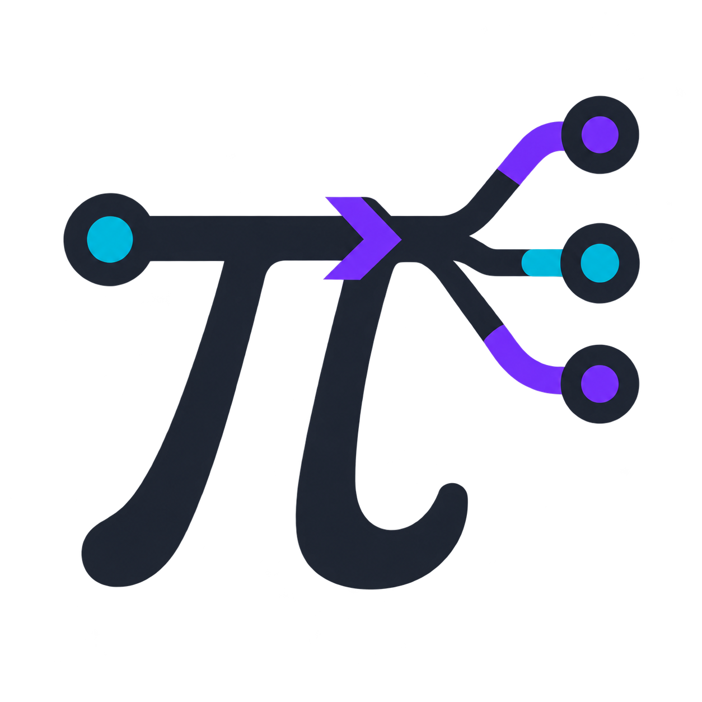

<p align="center">
  
</p>

# pi-callscript

[](https://pi.dev/packages/pi-callscript)
[](https://www.npmjs.com/package/pi-callscript)
[](https://bun.com/)
[](https://effect.website/)

`pi-callscript` adds one code-planning tool to Pi. It composes reads, searches, commands, and edits into structured execution flows. It supports parallel and dependent calls, reasoning checkpoints, background work, reversible edits, and a compact live trace. Other active Pi tools stay visible.

## Install

From npm:

```sh
pi install npm:pi-callscript
```

From GitHub:

```sh
pi install git:github.com/codewithkenzo/pi-callscript
```

Pi and Node.js 22.19 or newer are required.

## Use

CallScript starts enabled in additive mode. Ask Pi to use it, or manage it directly:

```text
/callscript status
/callscript on
/callscript off
/callscript reload
/callscript reset
```

`on` adds one `callscript` entry to the current active tool list. Repeated `on` commands do not create duplicates. `off` removes only `callscript`. Each transition uses the current active list, so tools added or removed by other owners keep their current state.

> CallScript is available beside other Pi tools. Use it for bounded programs over its listed fixed capabilities. Use the owning Pi tool directly for Fabric, FFF, MCP, subagent, and other extension operations.

The extension exposes one fixed-capability tool: `callscript`. It supports these file and process calls:

`read` · `write` · `edit` · `search` · `find` · `list` · `run`

It also supports these control and network calls:

- `http` — fetch bounded response text.
- `wait` — delay asynchronously without blocking Pi.
- `think` — return control to the model for a full reasoning turn, then resume the same plan.
- `snapshot` — capture exact files before a change.
- `undo` — restore a captured snapshot.

```js
const point = await snapshot({ paths: ["src/index.ts"] });
const [manifest, matches] = await Promise.all([
  read({ path: "package.json" }),
  search({ pattern: "TODO", path: "src", limit: 30 }),
]);
await think({ note: "choose the smallest useful edit" });
return { point, manifest, matches };
```

At `think`, downstream operations stay queued while the tool call returns to the model. The model gets a normal reasoning turn with the first wave's results, then reissues the unchanged script to resume from the saved checkpoint—completed calls are not repeated.

Each operation stays visible in Pi's native tool view with its target, short result, elapsed time, timeout, and live state. Use Pi's normal `Ctrl+O` toggle for expanded details.

Under the hood, [CallScript](https://callscript.dev/) validates the workflow as a bounded inert plan instead of evaluating model-authored JavaScript. That is what makes aggressive composition predictable without adding another code sandbox.

## Optional agent skill

Install the included skill when you want Pi to combine larger tool waves deliberately: carry results between dependent calls, pause only for real model judgment, continue from session bindings, bound fan-out, keep background work observable, and roll risky changes back.

With npm:

```sh
npx pi-callscript
```

With Bun:

```sh
bunx pi-callscript
```

This copies `SKILL.md` to `~/.agents/skills/pi-callscript/`. It is separate from the extension and is not installed by `pi install`.

## Configuration

Global settings live at `~/.pi/agent/callscript.json`. Project settings in `.pi/callscript.json` override them.

```json
{
  "mode": "on",
  "limits": {
    "maxSteps": 30,
    "maxItemsPerStep": 100,
    "maxTotalCalls": 200,
    "maxConcurrency": 12,
    "maxCallResultBytes": 10485760
  },
  "httpTimeoutMs": 30000,
  "maxHttpResultBytes": 5242880
}
```

These are execution limits, not a separate permission layer. File and shell behavior stays Pi-native. `run` uses PowerShell on Windows and Bash on Linux and macOS.

## Development

```sh
git clone https://github.com/codewithkenzo/pi-callscript.git
cd pi-callscript
bun install
bun run check
bun run smoke
```

`nix develop` opens the included Linux/macOS development shell. The project pins Bun 1.4.0; CI verifies Windows, macOS, and Linux with Node.js 22.19.
