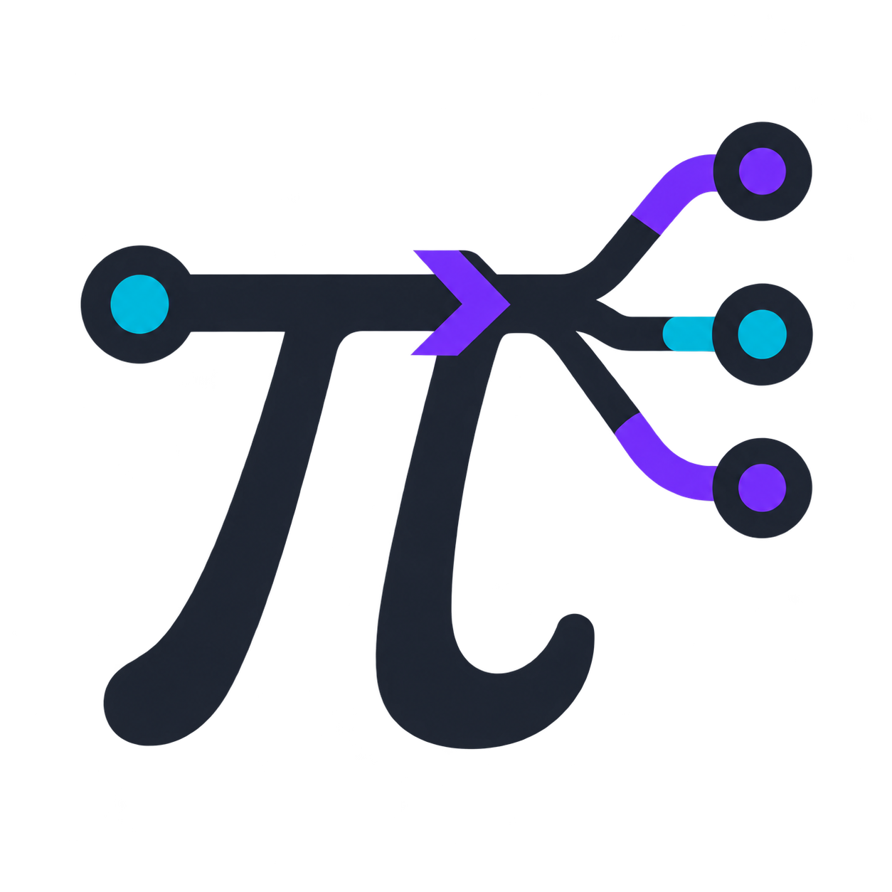

<p align="center">
  
</p>

# pi-callscript

[](https://pi.dev/packages/pi-callscript)
[](https://www.npmjs.com/package/pi-callscript)
[](https://bun.sh/)
[](https://effect.website/)

CallScript code mode for [Pi](https://pi.dev/), powered by Effect and built for fast agentic work.

`pi-callscript` lets an agent compose sequential, parallel, conditional, and background tool calls in one compact script. Pi keeps control of the actual file and shell tools, while [CallScript](https://callscript.dev/) compiles the script into a bounded inert plan—it is never evaluated as JavaScript.

## Install

Install from npm:

```sh
pi install npm:pi-callscript
```

As a regular project dependency:

```sh
npm install pi-callscript
```

Use `pi install` when you want Pi to register and manage the extension automatically.

Try it for one session without installing:

```sh
pi -e npm:pi-callscript
```

Install directly from GitHub:

```sh
pi install git:github.com/codewithkenzo/pi-callscript
```

Pi and Node.js 22.19 or newer are required. Bun is only needed to develop the package.

## Use

CallScript mode is enabled after installation. Ask Pi to use CallScript, or manage it directly:

```text
/callscript status
/callscript on
/callscript off
/callscript reload
/callscript reset
```

The agent receives three tools:

- `callscript` executes a plan.
- `callscript_search` finds an inner tool without loading every signature.
- `callscript_describe` returns exact signatures when needed.

Available operations are `read`, `write`, `edit`, `search`, `find`, `list`, `run`, `http`, `wait`, `think`, `snapshot`, and `undo`.

A plan can mix parallel work with an explicit reasoning checkpoint:

```js
const point = await snapshot({ paths: ["src/index.ts"] });
const [manifest, matches] = await Promise.all([
  read({ path: "package.json" }),
  search({ pattern: "TODO", path: "src" }),
]);
await think({ note: "choose the smallest useful edit" });
return { point, manifest, matches };
```

The native Pi tool view shows a compact vertical trace. Each operation stays visible with a ready, running, done, failed, or skipped state, plus its file, command, URL, timeout, and short result. Use Pi's normal `Ctrl+O` toggle for expanded details.

## Configuration

Global settings live at `~/.pi/agent/callscript.json`. Project settings in `.pi/callscript.json` override them.

```json
{
  "mode": "on",
  "limits": {
    "maxSteps": 30,
    "maxItemsPerStep": 100,
    "maxTotalCalls": 200,
    "maxConcurrency": 12,
    "maxCallResultBytes": 10485760
  },
  "httpTimeoutMs": 30000,
  "maxHttpResultBytes": 5242880
}
```

These are execution limits, not a separate permission layer. File and shell behavior remains Pi-native. `run` uses PowerShell on Windows and Bash on Linux and macOS.

## Development

```sh
git clone https://github.com/codewithkenzo/pi-callscript.git
cd pi-callscript
bun install
bun run check
bun run smoke
```

Use `nix develop` for the included Linux/macOS development shell. CI verifies the package on Windows, macOS, and Linux with Node.js 22.19.

Before publishing:

```sh
bun run pack:check
npm publish
```

Publishing to npm with the `pi-package` keyword makes the extension discoverable in Pi's package catalog.
